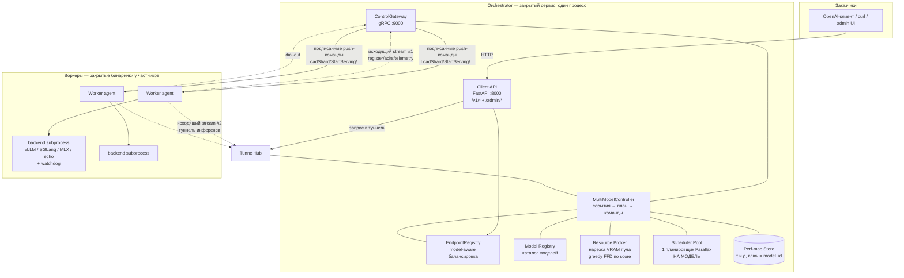
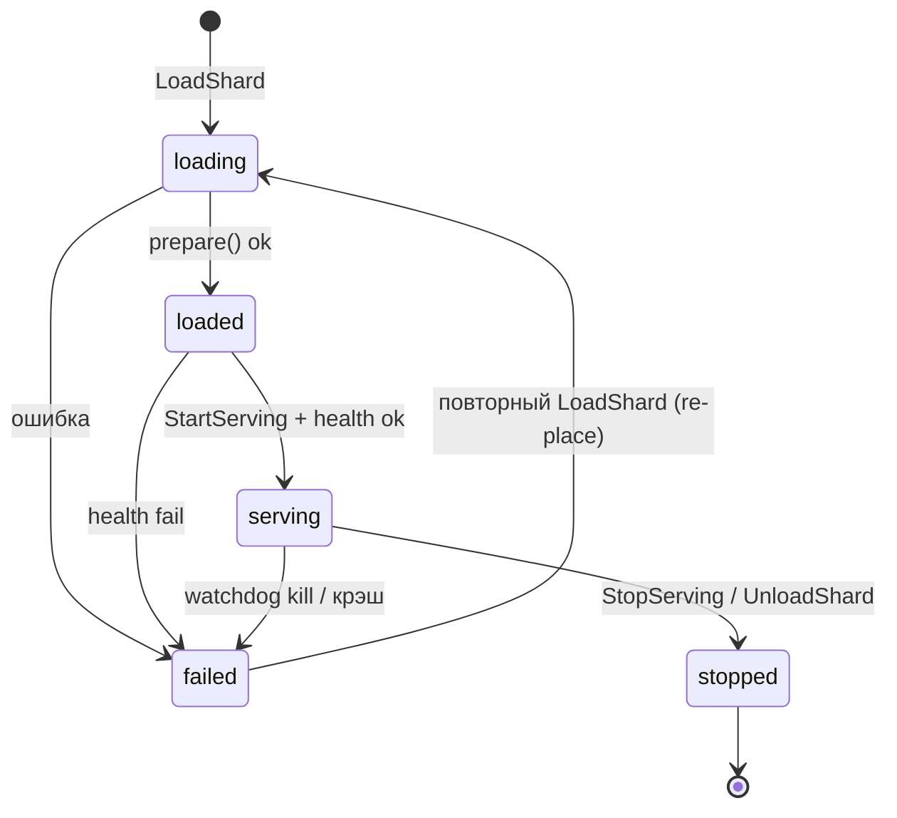
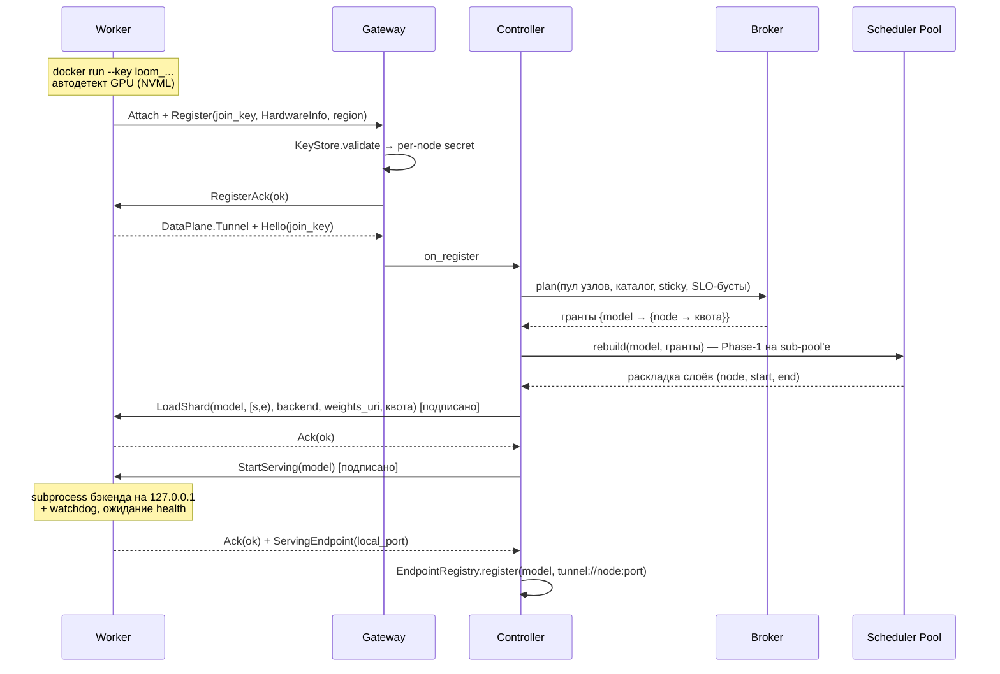
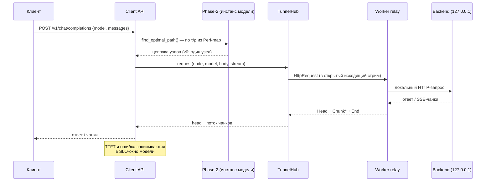
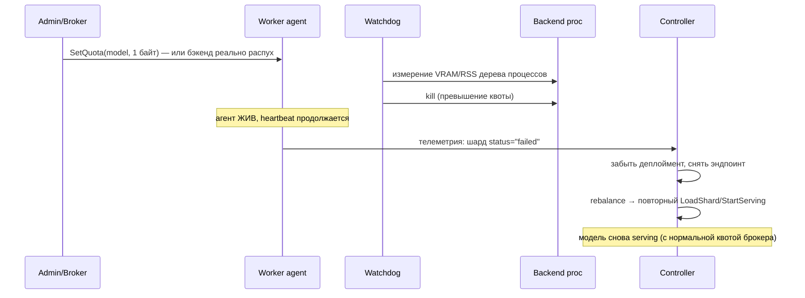

# Loom — архитектура системы (технический wiki-onepager)

_Обновлено: 2026-08-17. Статус реализации по фазам — в [PROGRESS.md](../PROGRESS.md),
происхождение заимствованного кода — в [NOTICE.md](../NOTICE.md)._

---

## 1. Что это такое

**Loom — маркетплейс вычислений для LLM-инференса.** Заказчики шлют обычные
OpenAI-совместимые запросы (`/v1/chat/completions`), исполнители — владельцы
GPU, в том числе недоверенные частные лица — предоставляют свои машины.
Оркестратор Loom решает, какая модель на каком железе живёт, режет VRAM узлов
на квоты между моделями и маршрутизирует каждый запрос на лучший узел.

Ядро планирования (какие слои модели на какой узел положить и по какой цепочке
узлов гнать запрос) **заимствовано из [Parallax](https://github.com/GradientHQ/parallax)**
(arXiv:2509.26182) и адаптировано. Ключевые отличия Loom от Parallax:

| | Parallax | Loom |
|---|---|---|
| Моделей на кластер | одна (один процесс = одна модель) | N моделей на общем пуле |
| Узел | доверенный, полноправный участник, open-source код | недоверенный исполнитель команд, закрытый бинарник |
| Координация | DHT (P2P, Lattica), узлы — участники консенсуса | hub-and-spoke: центральный оркестратор, воркеры только исполняют |
| Живые perf-данные | в DHT | централизованный Perf-map Store |
| Capacity узла (`c_i`) | вычисляется внутри `Node` из забинженной модели | **явный входной параметр** от Resource Broker (квота VRAM) |
| Подключение узла | `parallax join` + P2P-адреса/relay | один ключ: `docker run gihpee/loomworker --key loom_...` |
| Железо узла | автодетект (`detect_node_hardware`) | автодетект (та же идеология, NVML/torch/nvidia-smi) |
| Трафик инференса | P2P/relay между участниками | туннель внутри исходящего соединения воркера |

Ключевое свойство для маркетплейса: **владелец GPU выполняет одну команду и
больше ничего.** Ни портов, ни адресов, ни описания железа, ни подтверждений
на размещение моделей.

Почему hub-and-spoke, а не DHT-mesh: воркеры недоверенные — они не должны
видеть ни алгоритмы планирования, ни perf-данные чужих моделей. Вся ценная
логика живёт на оркестраторе; воркер — тупой исполнитель push-команд.

## 2. Стек

- **Python 3.11+**, менеджер пакетов/окружений — **uv**.
- Оркестратор: **grpc.aio** (control plane) + **FastAPI/uvicorn** (client API)
  в одном asyncio-процессе.
- Воркер: отдельный самодостаточный пакет (`worker/`), sync-**grpcio** +
  потоки, **psutil** (watchdog); собирается в закрытый Docker-образ.
- Контракты: **protobuf/gRPC** (стабы генерируются `scripts/gen_proto.py` и
  коммитятся — protoc в рантайме не нужен).
- Perf-map Store: интерфейс + **in-memory** реализация (используется сейчас) и
  **Redis**-реализация (ключи готовы, включение — конфигом). Каталог/биллинг:
  **Postgres** DDL ([src/loom/perfmap/schema.sql](../src/loom/perfmap/schema.sql)),
  накатывается в compose, начнёт использоваться с Фазы 4.
- Бэкенды инференса: **vLLM** (CUDA), **SGLang** (CUDA), **MLX** (Apple
  Silicon), **echo** (test-only заглушка без GPU).
- Развёртывание: **docker-compose** (`orchestrator`, `worker` xN, `redis`,
  `postgres`).
- Многостадийный исполнитель: **torch + transformers** (device-agnostic
  cpu/cuda), веса из **safetensors**.
- Тесты: **pytest** (`uv run pytest`), 84 теста, включая регрессионный
  паритет с оригинальным Parallax.

## 3. Карта репозитория

```
loom/
├── src/loom/
│   ├── planning/            # ЯДРО (порт из Parallax): Phase-1 + Phase-2
│   │   ├── model_info.py    #   футпринт модели (байты/FLOPs на слой)
│   │   ├── capacity.py      #   ShardCapacity — явный capacity-параметр (главная правка)
│   │   ├── node.py          #   Node: состояние узла глазами планировщика
│   │   ├── layer_allocation.py  # Phase-1: DP-упаковка слоёв + water-filling
│   │   ├── request_routing.py   # Phase-2: DAG DP выбора цепочки узлов
│   │   ├── node_management.py   # NodeManager: membership/lifecycle узлов
│   │   ├── scheduler.py     #   Scheduler: обвязка Phase-1+Phase-2 (1 шт = 1 модель)
│   │   └── batching.py      #   расчёт max batch из KV-бюджета (torch-free)
│   ├── perfmap/             # Perf-map Store (замена DHT) + Postgres DDL
│   ├── proto/               # ИСТОЧНИКИ контрактов (.proto)
│   ├── proto_gen/           # сгенерированные стабы (не редактировать руками)
│   ├── orchestrator/        # НАШ закрытый сервис
│   │   ├── registry.py      #   Model Registry (каталог моделей)
│   │   ├── broker.py        #   Resource Broker (нарезка пула между моделями)
│   │   ├── pool.py          #   Scheduler Pool (инстанс планировщика на модель)
│   │   ├── controller.py    #   MultiModelController — «мозг», связывает всё
│   │   ├── gateway.py       #   gRPC-сервер, сессии воркеров
│   │   ├── signing.py       #   подпись команд (HMAC)
│   │   ├── keys.py          #   join-ключи (выдача/отзыв/валидация)
│   │   ├── tunnel.py        #   TunnelHub: инференс через исходящий стрим воркера
│   │   ├── config.py        #   env-конфигурация
│   │   └── server.py        #   entrypoint (gRPC + HTTP + фоновые циклы)
│   └── api/                 # Client API + admin
│       ├── app.py           #   FastAPI: /v1/*, /admin/*
│       ├── endpoints.py     #   model-aware EndpointRegistry (порт из Parallax)
│       ├── lb_strategy.py   #   стратегии балансировки (порт as-is)
│       └── admin_ui.html    #   admin-дашборд (dev-инструмент)
├── worker/                  # САМОДОСТАТОЧНЫЙ пакет воркера (уходит частникам)
│   └── loom_worker/
│       ├── shard/           #   ЯДРО: исполнение части модели (стадии пайплайна)
│       │   ├── loader.py    #     загрузка только своих слоёв
│       │   ├── executor.py  #     forward по слоям + KV-кэш
│       │   └── server.py    #     HTTP стадии + цикл генерации на голове
│       ├── stage_relay.py   #   мост стадия ↔ туннель (активации)
│       ├── main.py          #   entrypoint (--key и больше ничего)
│       ├── hwinfo.py        #   автодетект GPU (NVML/torch/nvidia-smi/sysctl)
│       ├── joinkey.py       #   парсинг ключа (адрес + секрет)
│       ├── gateway_client.py#   исходящий stream команд
│       ├── dataplane_client.py# исходящий stream данных (relay на localhost)
│       ├── handlers.py      #   исполнение команд (без логики планирования!)
│       ├── security.py      #   проверка подписи/replay/freshness
│       ├── watchdog.py      #   контроль квот (NVML/RSS), kill нарушителя
│       ├── state.py         #   учёт шардов на узле
│       └── backends/        #   адаптеры: vllm, sglang, mlx (+launcher), echo
├── configs/                 # каталоги моделей (JSON)
├── tests/                   # юниты + e2e (in-process, без докера)
├── scripts/gen_proto.py     # генерация стабов в оба пакета
├── docker-compose.yml       # dev/демо-стек (echo-бэкенды, без GPU)
├── docker-compose.prod.yml  # прод-оркестратор (воркеры подключаются ключом)
├── docker/                  # Dockerfile'ы оркестратора (+ worker/Dockerfile)
└── docs/                    # этот файл, план Фазы 1 (бенчмарк, отложен)
```

## 4. Общая схема



Важно про направление соединений: **воркер сам звонит оркестратору и держит два
исходящих стрима** — командный и туннель данных. Оркестратор никогда не
подключается к воркеру: и команды, и запросы инференса едут внутрь уже открытых
соединений. Поэтому воркер не слушает ни одного порта наружу (бэкенд слушает
только `127.0.0.1`), и владельцу GPU не нужен ни публичный IP, ни
port-forwarding, ни объявленный адрес.

## 5. Глоссарий

- **Модель** — запись каталога: id, ссылка на веса, тип бэкенда, архитектурные
  параметры (`ModelInfo`) + рыночные сигналы (priority, demand_qps,
  price_willing).
- **Слой (layer)** — decoder-слой трансформера. Модель из `L` слоёв можно
  разрезать на непрерывные диапазоны `[start, end)` по разным узлам.
- **Шард** — диапазон слоёв одной модели на одном узле. В v0 почти всегда
  «полная модель» `[0, L)`, потому что межстадийный data plane ещё не собран.
- **Pipeline** — цепочка узлов, чьи шарды покрывают все слои `0..L` без дыр и
  перекрытий. `k` — число pipeline-реплик модели (больше k → больше throughput).
- **`c_i` (capacity)** — сколько decoder-слоёв влезает на узел. В Loom это
  функция **выданной брокером VRAM-квоты**, а не всего устройства.
- **τ (тау)** — латентность слоя на узле; **ρ (ро)** — RTT между узлами. Эти
  две величины — вход Phase-2.
- **Phase-1** — офлайн-упаковка: какие слои какой узел держит.
- **Phase-2** — онлайн-выбор: по какой цепочке узлов гнать конкретный запрос.
- **Rebalance / проход брокера** — пересчёт всей раскладки: brоker.plan() →
  дифф → команды воркерам.

## 6. Компоненты

### 6.1 `loom.planning` — ядро планирования (порт из Parallax)

Это библиотека, вызываемая программно; CLI у неё нет. **Один инстанс
`Scheduler` = одна модель.** Мультимодельность достигается не переделкой ядра,
а тем, что Scheduler Pool держит N независимых инстансов.

- **`ModelInfo`** ([model_info.py](../src/loom/planning/model_info.py)) —
  считает футпринт модели: байты параметров на decoder-слой
  (`decoder_layer_io_bytes`), FLOPs слоя, размер embedding/LM-head, KV-байты
  на токен. MoE и MLA (deepseek-style head dims) учтены. Всё планирование
  измеряет модель через этот класс.
- **`ShardCapacity`** ([capacity.py](../src/loom/planning/capacity.py)) — **та
  самая ключевая правка Loom**. В оригинале `Node` сам считал `c_i` из полной
  памяти устройства и забинженной модели. Здесь capacity — отдельный явный
  объект, который строит Resource Broker из выданной квоты:
  `ShardCapacity.from_model_info(mi, vram_quota_bytes=квота)`. Формулы — 1:1 с
  оригиналом (доли `param_mem_ratio`/`kvcache_mem_ratio`, вычет
  embedding/LM-head с учётом tie_embedding, множитель MLX), доказано
  паритетными тестами. Благодаря этому один физический GPU можно резать между
  моделями.
- **`Node`** ([node.py](../src/loom/planning/node.py)) — узел глазами
  планировщика: железо (`NodeHardwareInfo`), выданная capacity, текущий
  диапазон слоёв, латентность (измеренная или roofline-оценка), кэш RTT,
  загрузка. **Это не воркер!** Это его модель внутри одного инстанса
  планировщика; у одного физического воркера может быть по `Node`-объекту в
  нескольких инстансах (по числу моделей на нём).
- **Phase-1** ([layer_allocation.py](../src/loom/planning/layer_allocation.py)) —
  упаковка слоёв в пайплайны. Два аллокатора:
  `DynamicProgrammingLayerAllocator` (основной; DP по состоянию
  `dp(i, open_residuals, finished_pipes)` — умеет собирать несколько
  пайплайнов «вперемешку», максимизируя `Z(k)=k²/s*(k)`) и
  `GreedyLayerAllocator` (проще/быстрее). После сборки пайплайна слои внутри
  него перераспределяются **water-filling**'ом пропорционально TFLOPs узлов с
  ограничением по capacity. ⚠️ Математику этих алгоритмов менять нельзя
  (жёсткое ограничение ТЗ) — только оборачивать.
- **Phase-2** ([request_routing.py](../src/loom/planning/request_routing.py)) —
  выбор цепочки под запрос. Используется `DynamicProgrammingRouting`: DAG DP,
  вершины — шарды, ребро между шардами если `end(j)==start(i)`, вес вершины —
  τ, вес ребра — ρ; ищется цепочка минимальной суммарной латентности. Есть ещё
  RR/randomized стратегии по фиксированным пайплайнам (не используются в v0).
- **`NodeManager`** — потокобезопасный реестр узлов инстанса
  (ACTIVE/STANDBY), подсчёт полных пайплайнов.
- **`Scheduler`** — обвязка: bootstrap (позвать Phase-1), join/leave узлов,
  приём обновлений τ/ρ (`enqueue_node_update` → `_process_node_updates`),
  доступ к роутеру. В Loom его event-loop-потоки не запускаются — методы
  зовутся синхронно из контроллера.

### 6.2 `loom.perfmap` — Perf-map Store (замена DHT)

В Parallax живые τ/ρ лежали в DHT, и Phase-2 читал их оттуда. В Loom тот же
самый код Phase-2 **не изменился** — изменился источник: воркеры шлют
телеметрию оркестратору, тот кладёт её в Perf-map Store, а
[`sync.py`](../src/loom/perfmap/sync.py) периодически перекладывает данные в
инстанс планировщика через его же штатный `enqueue_node_update`.

Схема данных (всё ключуется `model_id` — это обязательное правило):

```
(model_id, node_id) -> ShardPerf {start_layer, end_layer, latency_ms,
                                  current_requests, is_healthy, updated_at}
(src_node, dst_node) -> rtt_ms
```

Записи протухают по TTL: замолчавший воркер не должен кормить роутинг
устаревшими латентностями. Реализации: `InMemoryPerfMapStore` (сейчас) и
`RedisPerfMapStore` (ключи `loom:perf:{model}:{node}`, `loom:rtt:{src}:{dst}`).
Если τ ещё не измерена, Phase-2 работает на roofline-оценке из `ModelInfo` —
система живёт и без телеметрии, просто менее точно.

### 6.3 Контракты control plane (`src/loom/proto`)

Три файла:

- **`worker_control.proto`** — канонический контракт команд (имена RPC
  зафиксированы ТЗ): `LoadShard`, `UnloadShard`, `SetQuota`, `StartServing`,
  `StopServing`, `ReportTelemetry`, `Heartbeat`. Каждая команда несёт
  `CommandMeta {command_id, issued_at_unix_ms, signature}`.
- **`gateway.proto`** — транспорт команд: `ControlGateway.Attach(stream
  WorkerMessage) returns (stream ControlMessage)`. Команды из worker_control
  ходят внутри `ControlMessage` (oneof), ответы (`Ack`, `TelemetryReport`,
  `ServingEndpoint`, `RegisterRequest`) — внутри `WorkerMessage`. Регистрация
  несёт `join_key` и **автоопределённый** `HardwareInfo`; `ServingEndpoint`
  сообщает только локальный порт бэкенда — адрес узла нигде не фигурирует.
- **`dataplane.proto`** — транспорт инференса: `DataPlane.Tunnel(stream
  TunnelMessage) returns (stream TunnelMessage)`. Внутри — HTTP-семантика
  (`HttpRequest` → `HttpResponseHead` → поток `HttpBodyChunk` → `HttpEnd`),
  мультиплексирование по `request_id`, отмена через `HttpCancel`.

Стабы генерируются в **два места** (`src/loom/proto_gen/` для оркестратора и
`worker/loom_worker/proto/` для воркера) командой:

```bash
uv run python scripts/gen_proto.py
```

Это сознательное дублирование: воркер не имеет права импортировать код
оркестратора, единственная связь — wire-формат protobuf.

**Безопасность команд** (Фаза 3): оркестратор подписывает каждую команду
HMAC-SHA256 поверх детерминированной сериализации сообщения с очищенным полем
подписи ([signing.py](../src/loom/orchestrator/signing.py)); ключ v0 —
onboarding-токен узла. Воркер ([security.py](../worker/loom_worker/security.py))
отклоняет: неверную подпись, повтор `command_id` (LRU-кэш — replay protection)
и устаревшие команды (окно `issued_at` ±60с). Подпись — в единственной точке
(`WorkerSession.send_command`), проверка — перед исполнением любой команды.

### 6.4 Orchestrator

- **Model Registry** ([registry.py](../src/loom/orchestrator/registry.py)) —
  каталог `ModelSpec` (= `ModelInfo` + weights_uri + backend_type + рыночные
  поля + опц. `slo_p95_ttft_ms`). Загружается из JSON
  (`LOOM_MODEL_CATALOG`), меняется на лету через `/admin/models`.
  `score = priority × price_willing × demand_qps` — единственная метрика
  порядка для брокера.

- **Resource Broker** ([broker.py](../src/loom/orchestrator/broker.py)) —
  офлайн-нарезка пула. Алгоритм (намеренно greedy FFD, не ILP):
  1. модели сортируются по score (с учётом SLO-бустов);
  2. для каждой модели считается `need` — VRAM на один pipeline
     (`pipeline_vram_bytes`: параметры всех слоёв + endpoints, делённые на
     `param_mem_ratio`) и целевое `k` (из `target_pipelines` или
     `demand_qps / qps_per_pipeline`);
  3. на каждый pipeline: выбирается регион с максимумом свободного VRAM,
     внутри — узлы по убыванию свободного (FFD), у узла забирается
     `min(free, remaining)` байт. **Pipeline не пересекает регионы** (v0;
     cross-region мост со штрафом — будущий шаг). Если k пайплайнов не
     влезло — k деградирует до 1; если и один не влез — модель unscheduled;
  4. **узел потребляется по байтам**: остаток VRAM остаётся в пуле для
     следующих моделей — так несколько моделей соседствуют на одном GPU
     (co-location через отдельные процессы с квотами, НЕ через общий
     multi-model процесс — это вне скоупа по ТЗ);
  5. **stickiness**: сначала попытка уложить pipeline целиком на узлы, где
     модель уже стоит; иначе — чистый FFD. Семантика «всё или ничего»:
     частичное прилипание дробит pipeline на бесполезные огрызки (был баг,
     закрыт тестами).

  Выход брокера — только гранты `{model → {node → vram_quota}}`. Раскладку
  слоёв внутри гранта делает немодифицированный Phase-1.

- **Scheduler Pool** ([pool.py](../src/loom/orchestrator/pool.py)) — держит
  `{model_id → ModelInstance(spec, scheduler, grants)}`. `rebuild()` собирает
  planning-`Node`'ы с `ShardCapacity` из грантов и зовёт `bootstrap()`.
  Rebalance v0 — полная переукладка инстанса (просто и предсказуемо;
  инкрементальность — потом).

- **MultiModelController** ([controller.py](../src/loom/orchestrator/controller.py)) —
  центральный связующий класс. События:

  | Событие | Реакция |
  |---|---|
  | воркер зарегистрировался | пул узлов += узел → rebalance |
  | воркер отвалился (stream закрылся) | узел из пула, эндпоинты/перф-записи снести → rebalance |
  | admin добавил/удалил модель | rebalance |
  | телеметрия: шард `failed` | забыть деплоймент, снять эндпоинт → rebalance (самовосстановление) |
  | SLO-нарушение (p95 TTFT > порога) | boost score модели ×2 (+1 к k) → rebalance; гистерезис снятия — p95 < 0.7×SLO |
  | таймер (`LOOM_REBALANCE_S`) | rebalance (safety net) |

  Внутри `rebalance()`: план брокера → дифф с фактом (`deployed`:
  `(model,node) → (quota,start,end)`) → **сначала awaited-вытеснения**
  (StopServing+UnloadShard), **потом** асинхронные деплои
  (LoadShard+StartServing) — чтобы VRAM узла никогда не была переподписана.
  Изменение квоты/слоёв = полный reload шарда (SetQuota-без-рестарта оставлен
  на будущее, RPC уже есть).

- **ControlGateway** ([gateway.py](../src/loom/orchestrator/gateway.py)) —
  gRPC-сервер. На каждого воркера — `WorkerSession`: очередь исходящих команд,
  future'ы ожидающих Ack'ов (корреляция по `command_id`), карта эндпоинтов.
  Первое сообщение стрима обязано быть `RegisterRequest` с валидным токеном.

### 6.4a Data-plane туннель + ключи подключения

- **`orchestrator/tunnel.py`** — `TunnelHub`: реестр живых туннелей
  (`node_id → TunnelSession`) и плюмбинг запросов. `request()` кладёт
  `HttpRequest` в исходящую очередь сессии и возвращает `(head, async-итератор
  чанков)`; каждый in-flight запрос имеет свою очередь событий (мультиплекс по
  `request_id`). Если стрим воркера закрылся хотя бы в одну сторону, сессия
  немедленно отцепляется — «полуживой» туннель не должен выглядеть здоровым
  (иначе запросы в него повисли бы).
- **`worker/loom_worker/dataplane_client.py`** — на каждый пришедший
  `HttpRequest` поднимает поток, ходит на `127.0.0.1:<порт бэкенда>` обычным
  `http.client` и стримит ответ чанками назад. Медленный бэкенд не блокирует
  остальные запросы.
- **`orchestrator/keys.py`** — `KeyStore`: выдача/отзыв/валидация join-ключей.
  Ключ = `loom_` + base64url(`{key_id, secret, address}`), то есть он несёт и
  адрес оркестратора, и секрет: воркеру не нужны другие параметры. Секрет
  одновременно служит **per-node ключом HMAC-подписи команд**, поэтому отзыв
  ключа отбирает и право исполнять команды. `max_nodes` ограничивает число
  машин на один ключ; хранилище персистится в JSON (`LOOM_KEYSTORE_PATH`).
- **`worker/loom_worker/hwinfo.py`** — автодетект железа (адаптация
  `detect_node_hardware` из Parallax): NVML → torch → `nvidia-smi` для NVIDIA,
  `sysctl` для Apple Silicon, иначе CPU-fallback; имя карты → TFLOPs и
  bandwidth по таблице. Env-переменные остались только как override для
  тестов. Неизвестная карта не роняет агент, а получает консервативную оценку.

### 6.4b Многостадийный инференс (ядро продукта)

Модель, не влезающая на одну карту, режется по слоям между узлами. Это то, для
чего вообще взят Parallax, и работает так:

- **Phase-1** (как и раньше) раскладывает слои: узел A получает `[0,k)`, узел B
  `[k,m)`, и так далее. `build_pipelines()` в контроллере группирует раскладку в
  упорядоченные цепочки-пайплайны (одна цепочка = одна реплика модели) и
  присваивает каждой стадии `pipeline_id` + `stage_index`.
- **Роли стадий** (взято из Parallax): стадия 0 владеет embeddings и клиентским
  запросом; последняя — LM head и сэмплингом; промежуточные только
  преобразуют hidden states.
- **`shard`-бэкенд** (`worker/loom_worker/shard/`) — единственный бэкенд,
  умеющий обслуживать ЧАСТЬ модели:
  - `loader.py` материализует только свой диапазон слоёв (safetensors,
    ремап `model.layers.{global}` → локальные `0..n-1`), опускает
    embed/lm_head там, где они не нужны;
  - `executor.py` гоняет forward по своим слоям с per-request KV-кэшем;
  - `server.py` — HTTP-поверхность стадии: `/stage/forward` (входящие
    активации), `/v1/chat/completions` (только на голове) и цикл генерации.
- **Транспорт активаций**: воркеры не видят друг друга (NAT, нет открытых
  портов), поэтому стадия отдаёт активации локальному relay агента
  (`stage_relay.py`), тот пушит `StageEnvelope` в свой туннель, а `TunnelHub`
  оркестратора по таблице `(pipeline_id, stage) → node` доставляет их узлу
  следующей стадии. Отступление от ТЗ (там разрешён прямой P2P между
  воркерами) сделано осознанно: прямое соединение требует hole-punching/relay-
  инфраструктуры и открытых портов, что противоречит принципу «владелец GPU
  ничего не настраивает». Прямой P2P остаётся возможной оптимизацией с
  fallback на этот путь.
- **Один шаг декодирования**: голова считает свои слои → активации идут по
  цепочке → последняя стадия сэмплит токен и отправляет его сразу голове →
  голова стримит токен клиенту и начинает следующий шаг.
- **Брокер считает слои, а не только байты**: `layers_fitting()` /
  `bytes_for_layers()` повторяют округление Phase-1 (floor на каждом узле).
  Без этого грант «ровно `pipeline_vram_bytes`», размазанный по N узлам, терял
  до N−1 слоёв на округлении, и Phase-1 не мог покрыть модель.

Ограничения v0 многостадийности: одна последовательность на запрос (нет
continuous batching), активации на проводе во float32, каждый хоп идёт через
оркестратор. Быстрый путь (портирование `ParallaxVLLMModelRunner` с paged
attention) — следующий шаг для производительности.

### 6.5 Client API (`src/loom/api`)

- `/v1/models` — каталог (+ флаг serving); `/v1/chat/completions` — вход
  заказчиков. Роутинг запроса: `model` из тела → `ModelInstance` → Phase-2
  (`find_optimal_path`) даёт головной узел → его serving-эндпоинт; fallback —
  **model-aware EndpointRegistry** (порт `EndpointRegistry` из Parallax с
  добавленным полем `model_id`: кандидаты выбираются ТОЛЬКО среди эндпоинтов
  той же модели; ключ реестра `(model_id, base_url)`). Прокси — passthrough,
  включая SSE-стриминг: бэкенды сами говорят на OpenAI-диалекте.
- Каждый запрос пишет TTFT/ошибку в контроллер — это сырьё для SLO-мониторинга.
- `/admin/*` — управление и наблюдение (токен `LOOM_ADMIN_TOKEN`, заголовок
  `X-Loom-Admin-Token`): `models` (CRUD), `status`, `nodes`, `models_view`,
  `perfmap/{model}`, `quota` (override для демо watchdog), `rebalance`
  (принудительный проход брокера), `ui` — дашборд для ручного тестирования
  (vanilla HTML/JS, вкладки Nodes/Models/Perf-map/SLO/Console; не продовый).

### 6.6 Worker (`worker/`)

Правила, которые нельзя нарушать:
1. **никакой логики планирования** — только исполнение команд;
2. **не импортирует** ничего из `src/loom` — самодостаточный пакет со своей
   копией proto-стабов (уходит частникам закрытым образом);
3. конфигурация только через env (`LOOM_ORCH_ADDR`, `LOOM_NODE_TOKEN`,
   `LOOM_DEVICE`, `LOOM_MEMORY_GB`, `LOOM_REGION`, …).

Устройство:

- **`gateway_client.py`** — держит исходящий bidi-stream, при обрыве
  переподключается (реконнект = повторная регистрация; оркестратор при этом
  считает прежние шарды потерянными и передеплоивает). Heartbeat-поток шлёт
  телеметрию раз в `LOOM_HEARTBEAT_S`.
- **`handlers.py`** — идемпотентные обработчики команд. `StartServing`
  выполняется в отдельном потоке (загрузка модели может занять минуты) и по
  готовности шлёт `Ack` + `ServingEndpoint` (URL OpenAI-эндпоинта бэкенда).
- **`backends/`** — единый интерфейс `BackendAdapter`
  (`prepare → start → wait_healthy → stop`, `pid()` для watchdog). Бэкенд =
  subprocess, снаружи выглядящий как OpenAI-сервер:
  - **vllm**: `vllm serve`, квота → `--gpu-memory-utilization` (доля от
    полного VRAM устройства);
  - **sglang**: `sglang.launch_server`, квота → `--mem-fraction-static`;
  - **mlx** (Apple Silicon, нативно, не в докере): у `mlx_lm.server` нет
    флага лимита памяти, поэтому запускается через обёртку
    `mlx_launcher.py`, которая делает `mx.set_memory_limit(bytes)` в том же
    процессе и передаёт управление серверу;
  - **echo**: test-only заглушка (отвечает `[echo:model] <текст>`), чтобы
    гонять весь контур на машинах без GPU. Не прод.
  Добавление нового бэкенда не трогает control plane (см. рецепт в §10).
  ⚠️ v0-ограничение всех прод-адаптеров: только полная модель
  (`start_layer=0`); частичные шарды ждут межстадийный data plane.
- **`watchdog.py`** — цикл контроля квоты: на CUDA меряет VRAM процесс-дерева
  бэкенда через NVML, иначе RSS (для MLX unified memory RSS — жёсткая
  страховка поверх мягкого лимита). Превышение → kill **только дерева
  бэкенда**; агент живёт, шард переходит в `failed`, телеметрия доносит это до
  оркестратора → самовосстановление.

Жизненный цикл шарда на воркере:



## 7. Ключевые потоки

### 7.1 Онбординг воркера и деплой модели



### 7.2 Запрос заказчика



Параллельно, вне пути запроса: воркеры шлют телеметрию (heartbeat) →
контроллер кладёт её в Perf-map Store → `perfmap_sync_loop` раз в N секунд
переливает свежие τ/ρ в инстансы планировщиков.

### 7.3 Ре-балансировка с вытеснением (пример из демо)

Пул: 1 узел 6 GB. Каталог: model-a (score 10), model-b (score 3), каждой нужно
~2.2 GB. Обе стоят. Через `/admin/models` приходит model-c (score 400):

1. брокер сортирует: c(400), a(10), b(3);
2. c получает 2.2 GB, a — 2.2 GB (sticky, остаётся на месте), b не влезает →
   `unscheduled`;
3. контроллер: **сначала** StopServing+UnloadShard для b (awaited), **потом**
   LoadShard+StartServing для c;
4. итог: a и c отвечают 200, b — 503; `/admin/status` показывает
   `unscheduled: ["demo-model-b"]`.

### 7.4 Watchdog и самовосстановление



## 8. Конфигурация

### Orchestrator (env)

| Переменная | Смысл | Default |
|---|---|---|
| `LOOM_MODEL_CATALOG` | путь к JSON-каталогу моделей | — (обязателен) |
| `LOOM_GRPC_PORT` / `LOOM_HTTP_PORT` | порты gateway / API | 9000 / 8000 |
| `LOOM_PUBLIC_ADDR` | адрес, который вшивается в join-ключи (воркеры звонят сюда) | `127.0.0.1:<grpc_port>` |
| `LOOM_KEYSTORE_PATH` | файл персистентного хранилища ключей | "" (только в памяти) |
| `LOOM_NODE_TOKEN` | dev/legacy мастер-токен вместо ключей | "" |
| `LOOM_PARAM_MEM_RATIO` / `LOOM_KVCACHE_MEM_RATIO` | как квота делится между весами и KV-кэшем | 0.6 / 0.3 |
| `LOOM_ADMIN_TOKEN` | токен admin-эндпоинтов ("" = без проверки, dev) | "" |
| `LOOM_REBALANCE_S` | период таймера ре-балансировки | 60 |
| `LOOM_PERFMAP_SYNC_S` | период синка Perf-map → планировщики | 5 |
| `LOOM_QPS_PER_PIPELINE` | пересчёт demand_qps → k | 10 |
| `LOOM_SLO_CHECK_S` / `LOOM_SLO_WINDOW_S` / `LOOM_SLO_MIN_SAMPLES` / `LOOM_SLO_BOOST` | параметры SLO-мониторинга | 10 / 60 / 10 / 2.0 |

### Worker (env)

| Переменная | Смысл | Default |
|---|---|---|
| `--key` / `LOOM_KEY` | join-ключ (несёт адрес оркестратора + секрет) | — (единственный обязательный параметр) |
| `--orchestrator` / `LOOM_ORCH_ADDR` | переопределить адрес из ключа | из ключа |
| `--node-id` / `LOOM_NODE_ID` | идентичность узла | hostname |
| `--region` / `LOOM_REGION` | регион для группировки брокером | default |
| `LOOM_DEVICE`, `LOOM_MEMORY_GB`, `LOOM_TFLOPS_FP16`, `LOOM_MEM_BW_GBPS`, `LOOM_NUM_GPUS`, `LOOM_GPU_NAME` | **override** автодетекта (только для тестов) | автодетект |
| `LOOM_VERIFY_COMMANDS` | 0 → отключить проверку подписи (dev) | 1 |
| `LOOM_WATCHDOG_POLL_S` | период watchdog | 2 |
| `LOOM_HEARTBEAT_S` | период телеметрии | 5 |

### Каталог моделей (JSON)

```jsonc
{ "models": [ {
    "model_id": "qwen3-0.6b",
    "weights_uri": "Qwen/Qwen3-0.6B",     // HF-имя (vllm/sglang/mlx) 
    "backend_type": "vllm",                // vllm | sglang | mlx | echo(test)
    "priority": 2, "demand_qps": 5, "price_willing": 1,
    "target_pipelines": 0,                 // 0 = вывести из demand_qps
    "slo_p95_ttft_ms": null,               // null = SLO-мониторинг выключен
    "model_info": { /* архитектура: num_layers, hidden_dim, ... */ }
} ] }
```

## 9. Как запускать и проверять

```bash
# тесты (без GPU и без докера; паритетные тесты стабят torch/mlx
# и читают оригинальный Parallax из ../dllmi/parallax)
cd loom && uv sync && uv run pytest

# dev-стек (echo-бэкенды, GPU не нужен)
docker compose up --build -d
curl -s localhost:8000/v1/models
open http://localhost:8000/admin/ui        # дашборд

# после правки .proto — регенерация стабов в оба пакета
uv run python scripts/gen_proto.py
```

E2e-тесты (`tests/test_phase*_e2e.py`) поднимают настоящий gRPC-стек
in-process через `tests/stack_utils.py` (OrchestratorHarness в asyncio-потоке +
WorkerHarness с реальными echo-подпроцессами) — это основной способ проверять
изменения control plane быстро, без докера.

## 10. Рецепты для доработки

**Добавить модель в прод**: запись в каталог (или `POST /admin/models`) — всё.
Брокер подхватит на ближайшем проходе.

**Добавить новый бэкенд**: один класс в `worker/loom_worker/backends/`,
реализующий `BackendAdapter` (команда запуска subprocess + health path +
маппинг квоты), плюс строчка в `BACKENDS`. Control plane, proto и оркестратор
не трогаются — проверено на SGLang/MLX.

**Поменять политику нарезки пула**: только `orchestrator/broker.py`. Контракт:
вход — `PoolNode[]` + `ModelSpec[]` (+previous, +boosts), выход — `BrokerPlan`
(гранты байтов). Phase-1/Phase-2 трогать нельзя.

**Изменить контракт воркера**: правка `.proto` → `gen_proto.py` → обработчик в
`worker/handlers.py` + отправитель в `controller.py`. Помнить: воркер должен
остаться без логики принятия решений.

## 11. Жёсткие правила (из ТЗ, действуют всегда)

1. `../dllmi/parallax` — **read-only**. Никогда не редактировать.
2. Математику Phase-1/Phase-2 (DP, water-filling) **не переписывать** — только
   оборачивать/параметризовать. Любое исключение — с явным обоснованием в PR.
3. Слово «parallax» не должно появляться в идентификаторах кода Loom; каждый
   заимствованный фрагмент несёт комментарий-атрибуцию (формат — в NOTICE.md).
4. Воркер не содержит логики размещения/маршрутизации и не импортирует код
   оркестратора.
5. Vector-knapsack / co-location нескольких моделей внутри одного
   backend-процесса — вне скоупа MVP (co-location делается отдельными
   процессами с VRAM-квотами).

## 12. Текущие ограничения и что дальше

- **Многостадийность реализована** (см. §6.4b): модель режется по слоям между
  узлами, активации идут через relay оркестратора, вывод побитово совпадает с
  однопроцессным прогоном. Ограничения текущей версии: исполнитель на
  transformers (без paged attention / continuous batching), одна
  последовательность на запрос, активации во float32, каждый хоп через
  оркестратор. Быстрый путь — портировать `ParallaxVLLMModelRunner`
  (наследник vLLM `GPUModelRunner` + патч `get_pp_indices`), нужен CUDA-стенд.
- **Реальные движки не прогонялись на GPU** (dev-машина — Mac без CUDA):
  vLLM/SGLang-адаптеры покрыты юнитами, e2e ходит на echo. Прод-образ
  ([docker/worker.cuda.Dockerfile](../docker/worker.cuda.Dockerfile)) и рунбук
  ([docs/DEPLOYMENT.md](DEPLOYMENT.md)) готовы к первому GPU-стенду. План
  бенчмарка против `parallax serve` — [docs/phase1-plan.md](phase1-plan.md).
- **Redis/Postgres подняты, но не подключены** к рантайму (in-memory Perf-map;
  Postgres — под Фазу 4).
- **Фаза 4 отложена** (решение 2026-08-16): keypair-онбординг,
  бенчмарк-калибровка деклараций, репутация/бан, биллинг-экспорт.
  Задел уже есть: поля `CommandMeta`, `nodes.pubkey`/`usage_records` в DDL,
  счётчики токенов в `ShardTelemetry`.
- **TLS/mTLS на транспорте** — gRPC пока insecure: порт 9000 нужно закрывать
  фаерволом/VPN до выхода в открытый интернет. Подпись команд (HMAC) и проверка
  ключей работают независимо от транспорта.
- Изменение квоты = рестарт шарда (SetQuota-без-рестарта — оптимизация на
  потом); cross-region pipeline не собирается (модель остаётся unscheduled).
